<!-- ╔══════════════════════════════════════════════════════════════════════╗
     ║  RIYAJ KAFARDEEN · GitHub Profile README                              ║
     ║  Source of truth: https://riyajkm.me  ·  CV (2026)                    ║
     ╚══════════════════════════════════════════════════════════════════════╝ -->

<div align="center">


<a href="https://riyajkm.me"></a>

<br/>

<a href="https://github.com/riyajkm"></a>
<a href="https://github.com/riyajkm?tab=followers"></a>
<a href="https://riyajkm.me"></a>
<a href="https://www.linkedin.com/in/riyajkm/"></a>
<a href="mailto:riyajkafar@gmail.com"></a>

<a href="mailto:riyajkafar@gmail.com?subject=Opportunity%20for%20Riyaj"></a>
<a href="https://riyajkm.me"></a>

<br/>

<kbd><a href="#-about-me">ABOUT</a></kbd> &nbsp;·&nbsp;
<kbd><a href="#-impact-at-a-glance">IMPACT</a></kbd> &nbsp;·&nbsp;
<kbd><a href="#-experience-timeline">EXPERIENCE</a></kbd> &nbsp;·&nbsp;
<kbd><a href="#-flagship-products">PRODUCTS</a></kbd> &nbsp;·&nbsp;
<kbd><a href="#-tech-arsenal">STACK</a></kbd> &nbsp;·&nbsp;
<kbd><a href="#-open-source--learning-labs">OPEN SOURCE</a></kbd> &nbsp;·&nbsp;
<kbd><a href="#-education--certifications">EDUCATION</a></kbd> &nbsp;·&nbsp;
<kbd><a href="#-github-telemetry">STATS</a></kbd> &nbsp;·&nbsp;
<kbd><a href="#-connect">CONNECT</a></kbd>

</div>

<br/>

## 🧬 About Me

<table>
<tr>
<td width="62%" valign="top">

```php
<?php

declare(strict_types=1);

namespace Riyaj;

final class RiyajKafardeen extends SoftwareEngineer
{
    public string   $role       = 'Senior Laravel & FilamentPHP Engineer';
    public string   $location   = 'Colombo, Sri Lanka 🇱🇰';
    public int      $experience = 4; // years in production, and counting
    public array    $core       = ['PHP 8+', 'Laravel 10/11', 'FilamentPHP',
                                   'Livewire', 'Inertia.js', 'React', 'MySQL'];
    public array    $founded    = ['IT Starter (Pvt) Ltd', 'BillBook.lk'];
    public array    $languages  = ['Tamil' => 'native',
                                   'English' => 'full professional',
                                   'Sinhala' => 'conversational'];
    public string   $status     = 'open-to-work';

    public function build(Idea $idea): Product
    {
        return $this->plan($idea)->design()->ship()->maintain();
    }
}
```

</td>
<td width="38%" valign="top">

<div align="center">

</div>

<br/>

I build and run **production PHP / Laravel systems** for clients in **Australia, the United Kingdom and Sri Lanka**: customer and admin portals, CRMs, ERPs, SaaS, e-commerce and workflow-heavy operational software.

I care about **data integrity, clean integrations and boring reliability**. I have led engineering teams, reviewed a lot of code, and founded a consultancy that has delivered **70+ projects**.

> *"Very little is needed to make a happy life."* — Marcus Aurelius

</td>
</tr>
</table>

<details>
<summary><b>🧭 What I actually do day to day</b></summary>
<br/>

| Area | What it looks like in practice |
|:--|:--|
| 🏗️ **Backend engineering** | Laravel 10/11, Eloquent, FilamentPHP admin panels, Livewire, queues, caching, authentication, multi-tenant SaaS |
| 🔌 **Integrations** | REST and SOAP third-party APIs, payment gateways, webhooks, checkout and ordering flows, integration error handling |
| 🗄️ **Data** | MySQL / MariaDB / Redis, relational schema design, query optimisation, migrations on live data |
| 🖥️ **Frontend** | React + Inertia.js, TypeScript, Alpine.js, Tailwind CSS, Blade |
| 🚀 **Operations** | Linux, Nginx, Docker, GitHub Actions CI/CD, AWS S3, VPS deployments and backups |
| ✅ **Quality** | PHPUnit / Pest, code reviews, production debugging and incident resolution |
| 🧑‍🏫 **Leadership** | Led up to five developers, mentoring, architecture decisions, client communication |

</details>

<br/>

## 📡 Impact at a Glance

<div align="center">

| 🕒 **4+ yrs** | 📦 **70+** | 🏪 **2,300+** | 🌍 **9** | 👥 **5** | 🎓 **1,500+** |
|:--:|:--:|:--:|:--:|:--:|:--:|
| production PHP / Laravel | projects delivered via IT Starter | businesses running BillBook.lk | countries served by a UK awarding-body platform I built on | developers led at LevelWeb | students served monthly on that platform |

</div>

<br/>

## 🚀 Experience Timeline

```text
 2022 ─────── 2023 ─────── 2024 ─────── 2025 ─────── 2026 ──▶
  ╎ Surge Global (intern)
  ╎          ╎ Shield Technologies ╎
  ╎          ╎ IT Starter ── Founder & Technical Lead ───────────────────────▶
  ╎          ╎              ╎ LevelWeb UK ── SE → Senior SE ───╎
  ╎          ╎              ╎                                  ╎ Asmorphic AU ──╎
```

<details open>
<summary><b>🇦🇺 Senior Laravel & FilamentPHP Developer (Contract) · Asmorphic Pty Ltd · Melbourne, Australia (Remote) · Sep 2025 – Sep 2026</b></summary>
<br/>

- Developed and maintained production Laravel applications and customer / admin portals for **telecom reseller ordering and provisioning**.
- Implemented **REST / SOAP third-party and payment-gateway integrations**, checkout and ordering workflows, and integration error handling.
- Contributed to product, order and purchase data-model improvements and e-commerce data collection covering **50,000+ products**.
- Supported operational reliability through debugging and production issue resolution.

`Laravel` `FilamentPHP` `Livewire` `MySQL` `REST` `SOAP` `Payment gateways`
</details>

<details open>
<summary><b>🇱🇰 Founder & Technical Lead · IT Starter (Pvt) Ltd · Colombo, Sri Lanka · Mar 2023 – Present</b></summary>
<br/>

- Founded a software consultancy that has delivered **70+ projects** across real estate, e-commerce, education, automotive and other sectors in Sri Lanka, the UK and Australia.
- Launched **[BillBook.lk](https://billbook.lk)**, a SaaS POS and billing platform now trusted by **2,300+ Sri Lankan businesses**.
- Delivered the **Dina Ali real estate website** and a **custom real estate CRM**, alongside operational systems, business websites and SaaS applications.
- Owned solution planning, database and application design, development, client communication, deployment and server backups.
- Led **two full-time engineers and three part-time collaborators**: implementation, mentoring, code review and delivery.

`Laravel` `FilamentPHP` `React` `Node.js` `MySQL` `WordPress / WooCommerce` `IoT` `Linux / Nginx`
</details>

<details>
<summary><b>🇬🇧 Software Engineer → Senior Software Engineer · LevelWeb (Level Web Limited) · United Kingdom (Remote) · Mar 2024 – Sep 2025</b></summary>
<br/>

- **Promoted to Senior Software Engineer within three months** and led **five developers** delivering ERP and student-management systems.
- Contributed to a **UK awarding-body platform used across nine countries**, serving **1,500+ students monthly**.
- Supported architecture decisions, code reviews, delivery coordination and mentoring on Laravel-based projects.
- Delivered secure, scalable solutions for educational institutions using the TALL stack, Inertia.js, React and Node.js.

`Laravel` `TALL stack` `Inertia.js` `React` `Node.js` `ERP` `Student Management`
</details>

<details>
<summary><b>🇱🇰 Software Engineer · Shield Technologies (Pvt) Ltd · Colombo, Sri Lanka (Hybrid) · Mar 2023 – Feb 2024</b></summary>
<br/>

- Built enterprise-level solutions using the Laravel ecosystem (TALL stack, Inertia.js).
- Developed robust APIs with React and Node.js; enhanced security measures and scaled internal tools.
- Collaborated with cross-functional teams to improve operational efficiency and user experience.

`Laravel` `Livewire` `Alpine.js` `Tailwind` `Inertia.js` `React` `Node.js`
</details>

<details>
<summary><b>🇱🇰 Intern Software Engineer · Surge Global (Pvt) Ltd · Colombo, Sri Lanka (Hybrid) · Sep 2022 – Feb 2023</b></summary>
<br/>

- Enhanced the **Surge Hub** product using the MERN stack (MongoDB, Express, React, Node.js).
- Contributed to system performance, feature development and refined internal workflows.

`MongoDB` `Express` `React` `Node.js`
</details>

<br/>

## 🛰️ Flagship Products

### 🧾 BillBook.lk &nbsp;<a href="https://billbook.lk"></a>

**Sri Lanka's POS and billing SaaS**, built and operated by IT Starter. POS terminal with barcode scanning, real-time multi-branch inventory, invoicing, and 15+ sales and profit reports. Used by supermarkets, pharmacies, restaurants, hotels, salons, wholesalers and hardware stores.


`Laravel` `FilamentPHP` `MySQL` `Redis` `Multi-tenant SaaS` `Multi-branch inventory` `Reporting`

### 🏢 IT Starter (Pvt) Ltd &nbsp;<a href="https://github.com/itstarter"></a>

**Software consultancy and product studio** I founded in 2023. 70+ delivered projects spanning real estate, e-commerce, education, automotive and SaaS, for clients in Sri Lanka, the UK and Australia. Mission: *a community that empowers people to share knowledge, explore new ideas and build together.*


`Consulting` `Product development` `Mentorship & internships` `Real estate` `E-commerce` `EdTech`

### 🗂️ Selected Client Work

| Project | Sector | What it does | Stack |
|:--|:--|:--|:--|
| **Dina Ali** | 🏠 Real estate | Client-facing real estate website with property listings and customer-enquiry workflows | `Laravel` `MySQL` |
| **Real Estate CRM** | 🏠 Real estate | Property, lead, agent, customer-enquiry and sales-tracking workflows for property operations | `Laravel` `FilamentPHP` `MySQL` |
| **Telecom Reseller Portals** | 📡 Telecom | Customer and admin portals for ordering and provisioning with payment-gateway and SOAP / REST integrations | `Laravel` `FilamentPHP` |
| **Awarding-Body Platform** | 🎓 EdTech | UK qualifications platform used in 9 countries by 1,500+ students monthly | `Laravel` `TALL` `Inertia.js` |
| **Team Comrade** | 🎓 Education | Tutorial-institute management system with RFID attendance | `Laravel` `React` `MySQL` `RFID` |
| **NCCLife** | 🛒 E-commerce | Storefront for mobile accessories and speakers with API integrations and SEO | `Laravel` `Blade` `MySQL` |
| **MaxMotors** | 🚗 Automotive | Car dealership and import-service site | `WordPress` `WooCommerce` |
| **Gliz** · **CityBazaar** | 🛒 E-commerce | Multi-category online shopping stores | `WordPress` `WooCommerce` `SEO` |
| **LilyMax** | 👗 Fashion | Kids fashion garment information website | `WordPress` |

<details>
<summary><b>🤝 Collaborations and partners</b></summary>
<br/>

| Partner | Collaboration |
|:--|:--|
| **MagicBit** | IoT and STEM education solutions |
| **BeeFactory** | Advanced data-analytics projects |
| **Institute of Innovators** | Research initiatives |
| **Synenx IT** | Enterprise-level software solutions |
| **Olee AI** | AI-driven customer-experience platforms |

</details>

<br/>

## ⚡ Tech Arsenal

<div align="center">

### 🟥 Core: PHP & Laravel Ecosystem


### 🟦 Frontend


### 🟩 Backend & APIs


### 🟪 Data


### 🟧 DevOps & Cloud


### 🟨 CMS, IoT & Tooling


</div>

### 📊 Proficiency Matrix

```text
Laravel & FilamentPHP      ████████████████████████████████████████████░░░  95%
React & Inertia.js         ██████████████████████████████████████████░░░░░  90%
MySQL & Database Design    ████████████████████████████████████████░░░░░░░  85%
TypeScript & Node.js       ████████████████████████████████████████░░░░░░░  85%
DevOps & CI/CD             ███████████████████████████████████░░░░░░░░░░░░  75%
```

<br/>

## 🧪 Open Source & Learning Labs

<div align="center">

<a href="https://github.com/riyajkm/salah-tv"></a>
<a href="https://github.com/riyajkm/filament-learn"></a>
<a href="https://github.com/riyajkm/laravel-react-spatie-learn"></a>
<a href="https://github.com/riyajkm/student-rfid"></a>
<a href="https://github.com/riyajkm/bookmark-organizer"></a>
<a href="https://github.com/riyajkm/vehicle-speed-detection-using-opencv"></a>

</div>

<details>
<summary><b>📚 Full catalogue of public repos</b></summary>
<br/>

| Repository | What it is | Language |
|:--|:--|:--|
| [salah-tv](https://github.com/riyajkm/salah-tv) | Offline full-screen prayer-time clock for mosque Android TVs (ACJU timetable, Sri Lanka) | Dart / Flutter |
| [filament-learn](https://github.com/riyajkm/filament-learn) | Concise FilamentPHP tutorials, best practices and snippets for admin panels | PHP |
| [filament-multi-panel](https://github.com/riyajkm/filament-multi-panel) | Multi-panel Filament setup reference | Blade |
| [filament-blog](https://github.com/riyajkm/filament-blog) | Blog engine on Filament | Blade |
| [laravel-12-learn](https://github.com/riyajkm/laravel-12-learn) | Laravel 12 exploration notes and code | Blade |
| [laravel-react-spatie-learn](https://github.com/riyajkm/laravel-react-spatie-learn) | Laravel + React + Spatie: role-based auth and API security guide | JavaScript |
| [laravel-react-learn](https://github.com/riyajkm/laravel-react-learn) | Integrating React with Laravel for dynamic web apps | JavaScript |
| [laravel-blade-learn](https://github.com/riyajkm/laravel-blade-learn) | Mastering Blade: components, directives and best practices | Blade |
| [api-example-app](https://github.com/riyajkm/api-example-app) | Laravel API reference implementation | Blade |
| [accounting-management](https://github.com/riyajkm/accounting-management) | Accounting management app | Blade |
| [finance-tracker](https://github.com/riyajkm/finance-tracker) | Personal finance tracker | PHP |
| [Daily-Expense-Tracker](https://github.com/riyajkm/Daily-Expense-Tracker) | PHP / MySQL daily expense tracker with dashboard and reports | JavaScript |
| [student-rfid](https://github.com/riyajkm/student-rfid) | RFID student management with automated attendance and real-time monitoring | JavaScript |
| [bookmark-organizer](https://github.com/riyajkm/bookmark-organizer) | Chrome extension: drag-and-drop bookmarks, real-time search, dark mode | JavaScript |
| [vehicle-speed-detection-using-opencv](https://github.com/riyajkm/vehicle-speed-detection-using-opencv) | Vehicle speed estimation with OpenCV | Python |
| [ar-ring](https://github.com/riyajkm/ar-ring) · [3d-ring](https://github.com/riyajkm/3d-ring) | AR and 3D ring try-on experiments | JavaScript |
| [its_ramadan](https://github.com/riyajkm/its_ramadan) | IT Starter Ramadan utility | JavaScript |
| [internship-2025](https://github.com/riyajkm/internship-2025) | IT Starter internship programme material | Blade |
| [Traffic-Squad](https://github.com/riyajkm/Traffic-Squad) · [Traffic-Squad-Website](https://github.com/riyajkm/Traffic-Squad-Website) | Traffic Squad project and site | HTML |
| [Sliit.MTIT](https://github.com/riyajkm/Sliit.MTIT) | SLIIT coursework | C# |
| [tailwindui](https://github.com/riyajkm/tailwindui) | Tailwind UI experiments | HTML |

</details>

<br/>

## 🛠️ What I Can Help With

| 💻 Full-Stack Development | 🔌 API & Integration | 🧠 Technical Consultation | 🎨 UI / UX |
|:--|:--|:--|:--|
| End-to-end Laravel / React apps, SaaS, portals, ERPs and CRMs | Payment gateways, REST / SOAP, webhooks, event-driven flows, API security | Stack selection, architecture, code reviews, performance, documentation | Figma prototyping, responsive design, accessibility (WCAG), micro-interactions |

<br/>

## 🎓 Education & Certifications

| Qualification | Institution | Period |
|:--|:--|:--|
| 🎓 **BSc (Hons) in Information Technology (Special)** | Sri Lanka Institute of Information Technology (SLIIT) | 2019 – 2024 |
| 🧑‍💻 **Trainee Full Stack Developer Programme** | University of Moratuwa (CODL) | 2022 |

<details>
<summary><b>📜 Certifications (9)</b></summary>
<br/>

| Certificate | Issuer | Date | Skills |
|:--|:--|:--|:--|
| Professional Practice in Software Development ⭐ | CODL, University of Moratuwa | Jul 2022 | Software development, project management, Agile |
| Foundations of Project Management | CODL, University of Moratuwa | Jul 2024 | Project management, Agile, Scrum |
| Server-side Web Programming | CODL, University of Moratuwa | Jul 2022 | Node.js, Express, Django |
| Front-End Web Development | CODL, University of Moratuwa | Jul 2022 | Angular, React, Vue |
| Web Design for Beginners | CODL, University of Moratuwa | Jun 2022 | HTML, CSS, JavaScript |
| Python Programming | CODL, University of Moratuwa | Jun 2022 | Python |
| Python for Beginners | CODL, University of Moratuwa | Apr 2022 | Python |
| Redux Saga with React | Udemy | Sep 2023 | React, Redux, JavaScript |
| Redux with React JS | Udemy | Sep 2023 | React, Redux, JavaScript |

</details>

<br/>

## 📈 GitHub Telemetry

<div align="center">


<picture>
  <source media="(prefers-color-scheme: dark)" srcset="https://raw.githubusercontent.com/riyajkm/riyajkm/output/github-snake-dark.svg" />
  <source media="(prefers-color-scheme: light)" srcset="https://raw.githubusercontent.com/riyajkm/riyajkm/output/github-snake.svg" />
  
</picture>

</div>

<br/>

## 🌐 Connect

<div align="center">

<a href="https://riyajkm.me"></a>
<a href="https://www.linkedin.com/in/riyajkm/"></a>
<a href="mailto:riyajkafar@gmail.com"></a>
<a href="https://www.youtube.com/@riyaj-km"></a>
<a href="https://www.instagram.com/riyajkm/"></a>
<a href="https://facebook.com/riyajkm"></a>
<a href="https://www.tiktok.com/@riyajkaf"></a>
<a href="https://billbook.lk"></a>

<br/><br/>

```text
┌──────────────────────────────────────────────────────────────────────┐
│  STATUS      ●  open to full-time roles · remote or Dubai, UAE       │
│  BEST FOR    ●  Laravel / FilamentPHP backends · CRMs · SaaS · APIs  │
│  RESPONSE    ●  usually within 24 h  (UTC+5:30)                       │
│  CONTACT     ●  riyajkafar@gmail.com · linkedin.com/in/riyajkm        │
└──────────────────────────────────────────────────────────────────────┘
```

💬 Building something in Laravel, shipping a SaaS, or need a senior engineer who treats production like it matters? **Let's talk.**

</div>


<div align="center">
<sub>Crafted with ☕ in Colombo · README last refreshed October 2026 · Data sourced from <a href="https://riyajkm.me">riyajkm.me</a></sub>
</div>
